# Kottans-Frontend

## Greetings, folks! Arsen here, hailing all the way from the charming city of Drohobych. Brace yourselves, I come with a joke for every situation! _winks_
Woo-hoo! I'm one lucky duck for getting to learn on this intro course for free! And a big thank you to the support crew and the cuddly-warm atmosphere in the chat! Y'all are just a bunch of cute little kittens!

> 

>   
Press here, this is you.

>  

## Tasks

-   [x] [Git Basics](#git-basics)
-   [x] [Linux CLI, and HTTP](#linux-cli-and-http)
-   [x] [Git Collaboration](#git-collaboration)
-   [x] [Intro to HTML and CSS](#intro-to-html-and-css)
-   [x] [Responsive Web Design](#responsive-web-design)
-   [x] [HTML CSS Popup](#html-css-popup)
-   [x] [JS Basics](#js-basics)
-   [x] [DOM](#dom)
-   [x] [Tiny JS World](#tiny-js-world)
-   [x] [Object Oriented JS](#object-oriented-js)
-   [x] [OOP Exercise](#oop-exercise)
-   [ ] [Offline Web Applications](#offline-web-applications)
-   [ ] [Memory Pair Game](#memory-pair-game)
-   [ ] [Website Performance Optimization](#website-performance-optimization)
-   [ ] [Friends App](#friends-app)

## Git Basics

1. As a newcomer to the world of programming, I was in for a real treat. I was initially intimidated by the thought of using the Terminal on my Macbook, but then I discovered the beauty of Visual Studio Code (VSC) and life was never the same.

2. After two days of dedicated effort, I finally understood the awesomeness that is Git. The sheer brilliance of its design and features left me in awe. Whether you're flying solo or part of a team, Git makes collaborating on projects a breeze.

2. I'm excited to continue my programming journey and put my newfound Git skills to the test. With time and practice, I know I'll be able to fully internalize these concepts and reach new levels of understanding.

## Linux CLI, and HTTP

> 

>   
Linux Survival Screenshots

> 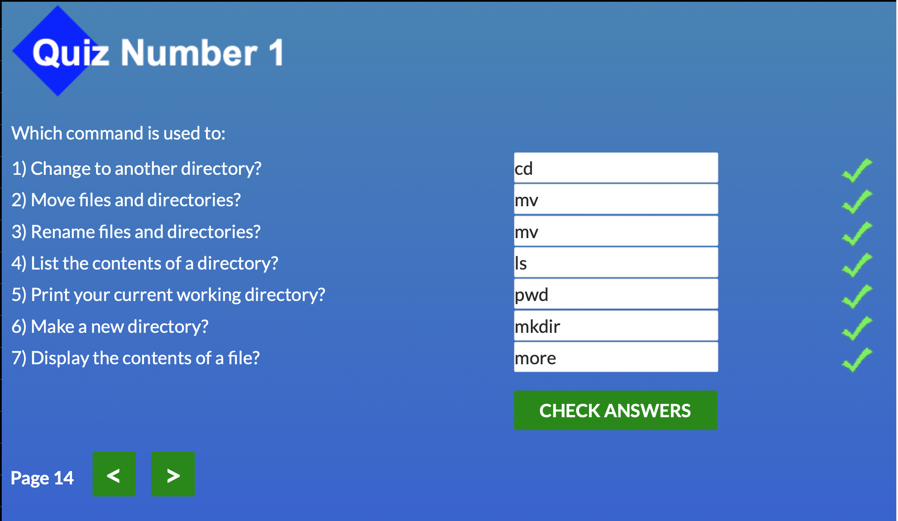   

> 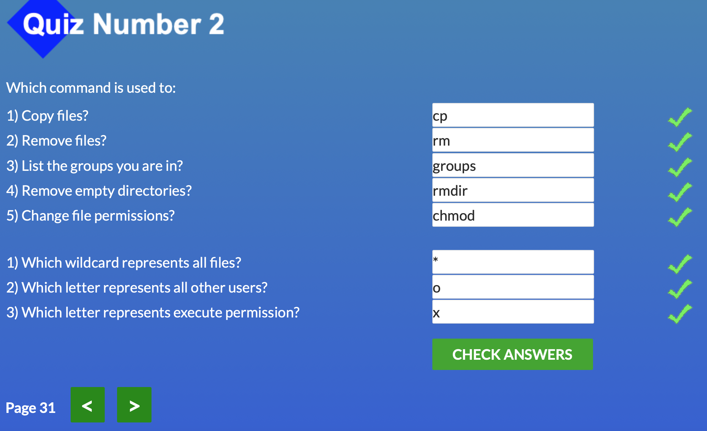   

> 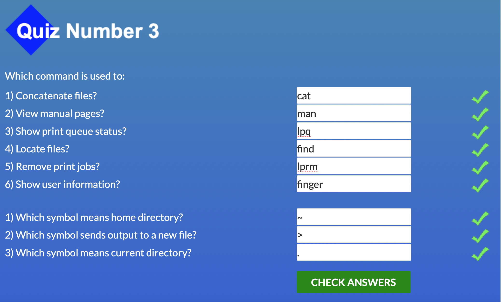   

> 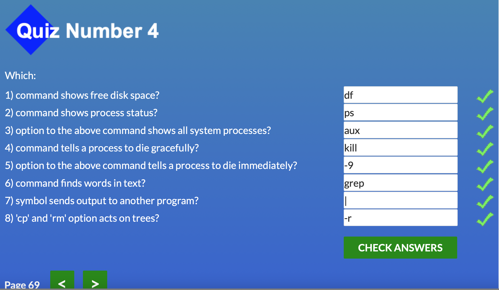 

1. Finally, I got to step into the mysterious world of the Linux command line! After using a Macbook for six whole years, I never really got around to exploring the terminal. But boy, am I excited to be manipulating my file system like a pro! The article about the HTTP protocol? That was a whole different story. I was like a deer in the headlights, not having a clue about how a browser works. But after some intense reading and research, I've got a basic understanding now. And the best part? I've still got so much more to learn!

2. Data transfer protocols and systems, huh? I was thoroughly impressed by the coherence and thoroughness of it all. And the <code>chmode</code> command? I thought it was some sort of magic solution to launch torrent programs, but nope! It's just a simple rights change. Who knew?

3. I'm already using some of the Linux commands like a pro - <code>cd</code>, <code>chmode</code>, <code>ls-l</code>, and more. Although, I'm still discovering the terminal's full potential, I'm on the right path. As for the HTTP article, I'm still trying to wrap my head around it, but I'm confident that with time and more learning, I'll get there. After all, slow and steady wins the race! (Or at least, that's what Mom`s telling me.)

## Git Collaboration

> 

>   
Git Basics on Coursera

> 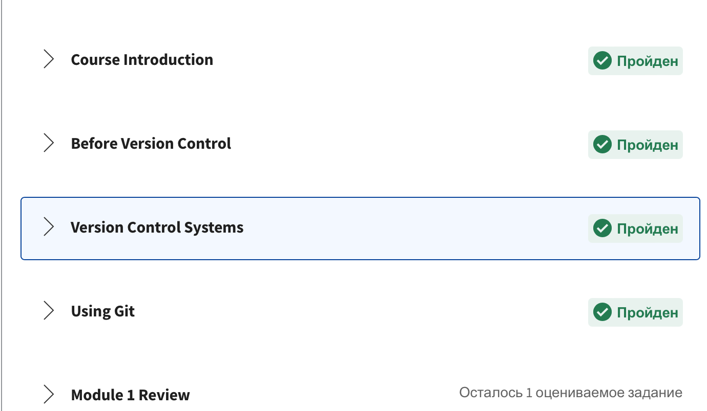   

> 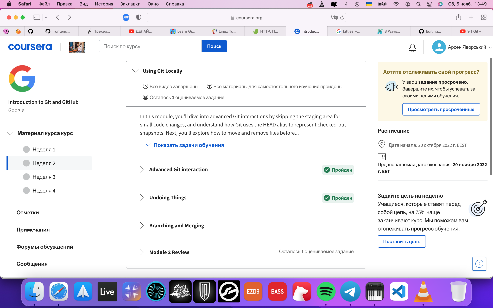   

> 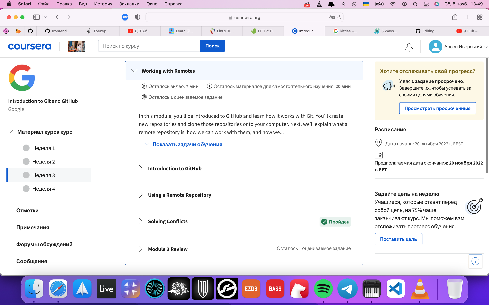   

> 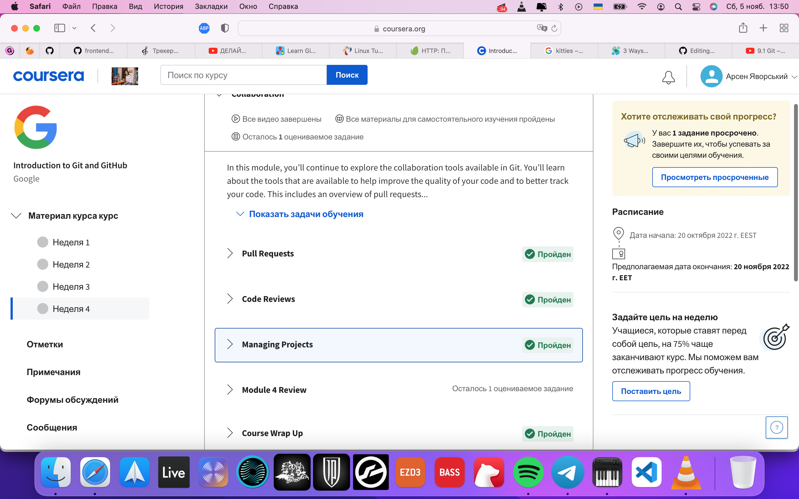 

> 

>   
learngitbranching.js.org

> 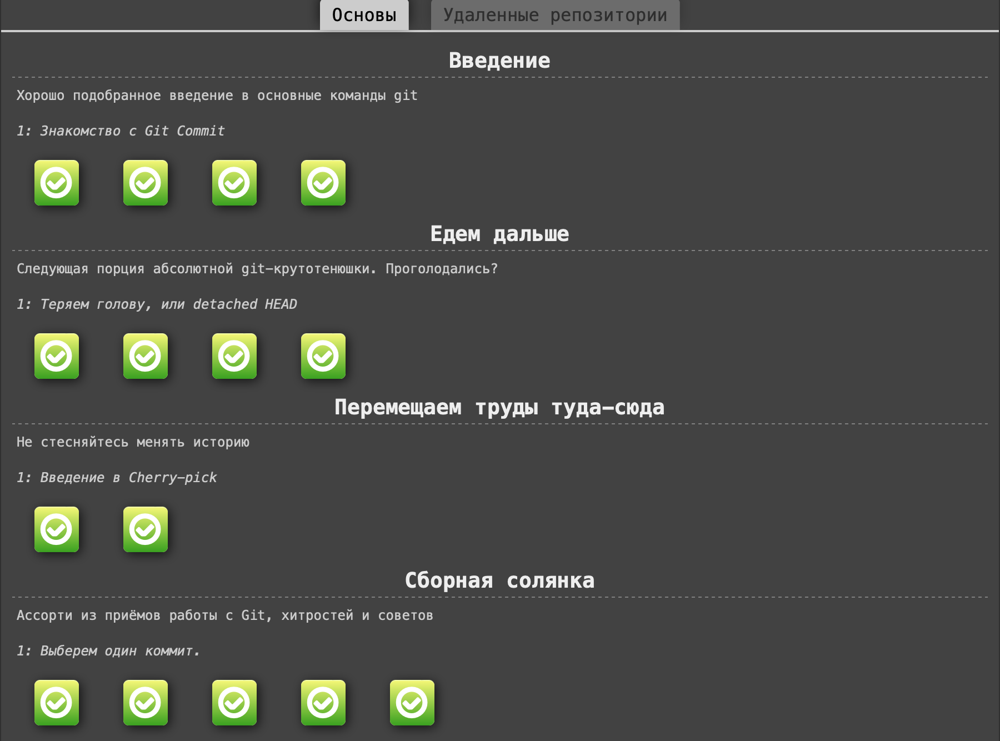   

>    

> 

1. Git, oh Git, where do I begin? I feel like I've just unlocked the secrets of the universe after completing my studies on this amazing tool. I can now visualize Git commands as if they're sending me telepathic messages, like "git clone, git push, git merge, you got this!"

2. Who knew there was so much to learn about Git? I was pleasantly surprised by the depth of the commands I thought were simple, but now I'm a Git master. The difference between fetch and pull? Child's play. Understanding upstream? Easy peasy. Rebase and cherry-pick? Just a walk in the park.

3. Time to put my Git skills to the test! I'm ready to tackle complex tasks like a boss, beyond just editing README.md. Brace yourselves, Git world, I'm coming for you! (╯°□°)╯︵ ┻━┻

## Intro to HTML and CSS

> 

>   
"Intro to HTML and CSS" on Coursera

>    

>  

> 

>   
"Learn HTML and CSS" on CodeCamp

>    

>  

1. As a beginner in HTML and CSS, I stumbled upon a whole new world of wonders! From tags that are plain text to tags that have superpowers, I was amazed by the limitless possibilities that HTML and CSS have to offer. Who knew a few lines of code could create such magic on the internet!

2. The deeper I delved into HTML and CSS, the more I realized how simple yet powerful these tools are. It's like having a toolbox that can turn a blank canvas into a masterpiece. I mean, who needs Picasso when you've got HTML and CSS, right?

3. With a goal of creating a pop-up that will leave everyone in awe, I dived into learning the techniques that would help me achieve it. It was like putting together a jigsaw puzzle, where each piece was a new concept to learn. From creating a navigation bar that's cooler than the Fonz, to making the scroll menu disappear like a magician, I was on a mission to master it all. I'm ready to take on this task, even if it means I'll have to tame the overflow beast!.

## Responsive Web Design

> 

>   
"FLEXBOX. Вчимося верстати на флексах

> 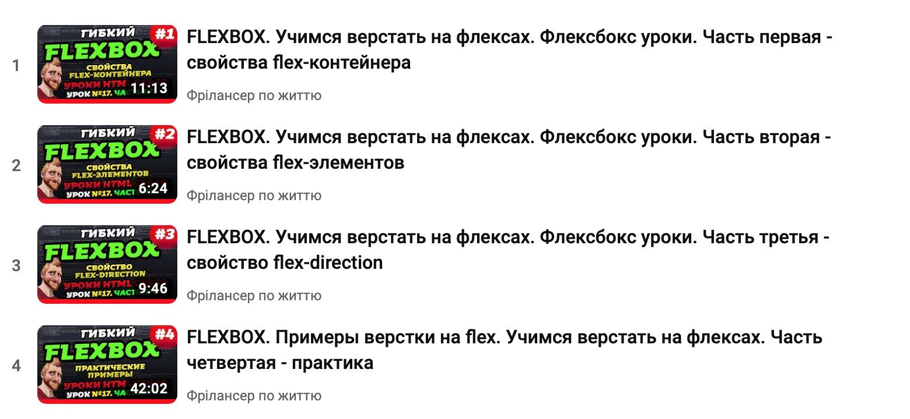 

> 

>   
"Flexbox Froggy

> 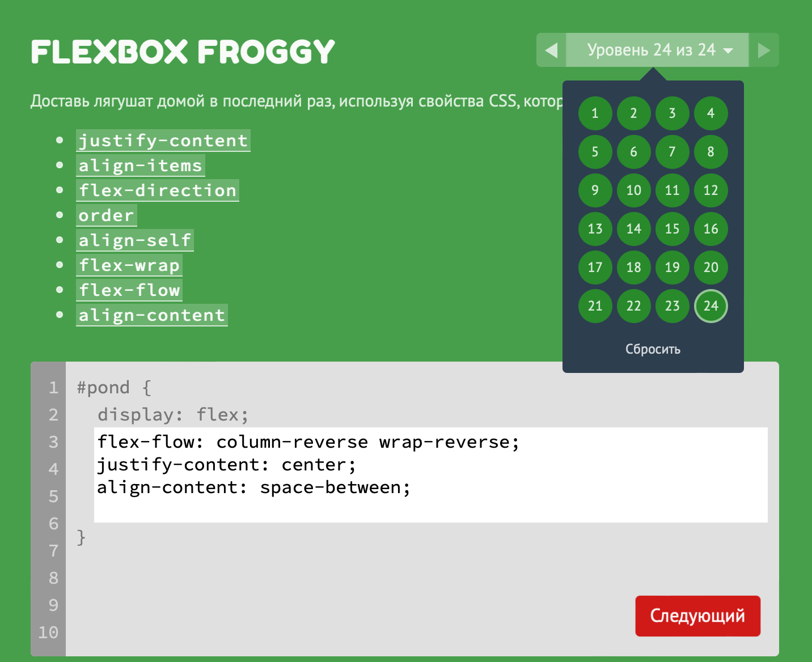 

> 

>   
"CSS Grid Layout"

> 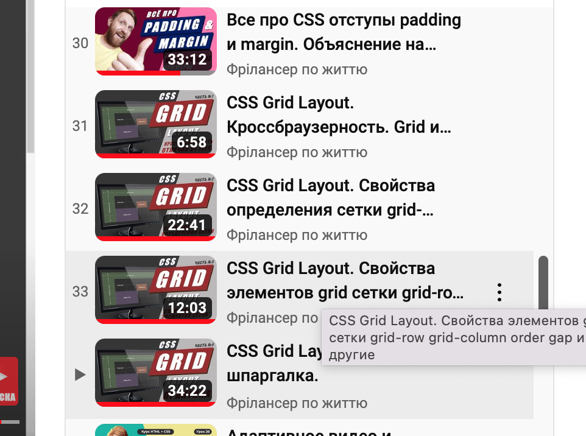 

> 

>   
"Grid Garden"

> 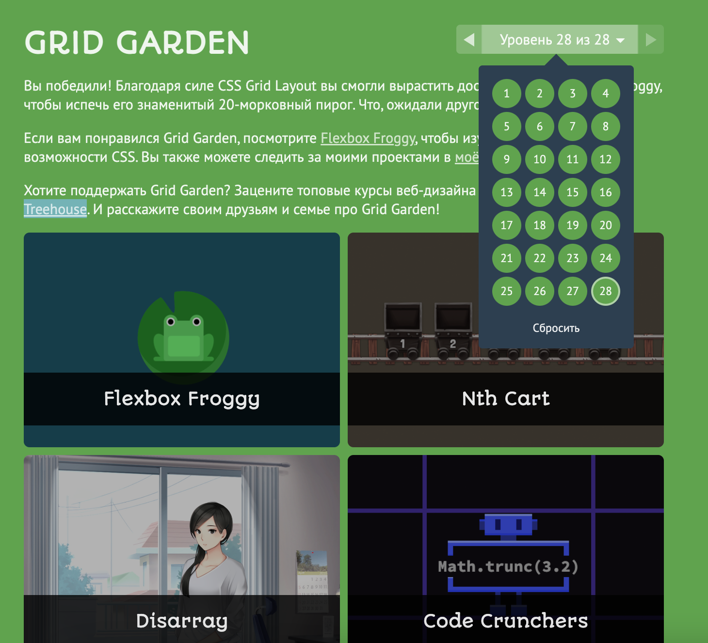 

1. I've been slaying it in the CSS and responsive design game! I took the task assigned to me on responsive design and turned it into a month and a half long extravaganza, completing four responsive websites and mastering the basics of CSS. I was pleasantly surprised by how easy it was to create animations and transformations, and flex has quickly become my trusty sidekick in my CSS toolkit. Of course, there were some challenges, like figuring out the perfect proportions and interactions, but with a lot of hard work and determination, I was able to conquer them all.

2. Who knew that animations and transformations could be so easy to create? I used to think that only the most talented web developers were capable of performing the magic tricks I saw on websites, like changing the position of an element when hovering. But I soon learned that animations are actually quite manageable, and that's when the fun began!

3. Flex has been a game-changer for me in my CSS journey, but I'm keeping an open mind as I continue to develop my skills. I'm already experimenting with different transformations and feel like I'm starting to gain expertise. On the other hand, I still have some work to do, like learning how to use variables other than colors and writing more concise media requests. But I'm determined to keep learning and improving, and my ultimate goal is to master JavaScript. I've already checked out FreeCodeCamp and Codecademy, and I have a long list of other courses waiting for me. The journey to becoming a JavaScript master might be long, but I'm ready to put in the work and dedication!

## HTML CSS Popup

[Demo](https://yazdrahobycha.github.io/HTML-CSS-Popup/) | [Code Base](https://github.com/yazdrahobycha/HTML-CSS-Popup) | [Pull Request](https://github.com/kottans/frontend-2019-p2p/pull/215)  

The project was a roller coaster of emotions, but mostly excitement! I thought manipulating checkboxes would be a walk in the park, but boy, was I in for a surprise. Trying to arrange them with the focus state was like playing a game of Jenga, one wrong move and everything comes tumbling down. But, with perseverance and a few burnt midnight oil, I finally got the hang of it.

As for the end result, it was a beautiful sight to behold. I was pleasantly surprised that it turned out to be way better looking than I thought it would be. I mean, it's like I stumbled upon a secret formula that only design wizards know of. I'll take all the credit for it, even though I have zero design skills (or so I thought).

However, there's always room for improvement, and in this case, it's fullscreen adaptability. I'm already working on it and can't wait to see the final product. Overall, this project was an excellent opportunity for me to learn and grow, and the satisfaction of completing a challenging project is truly worth every penny (or lack thereof).

## JS Basics

> 

>   
Coursera JS Basics

>  

> 

>   
FreeCodeCamp JS tasks

>    

> 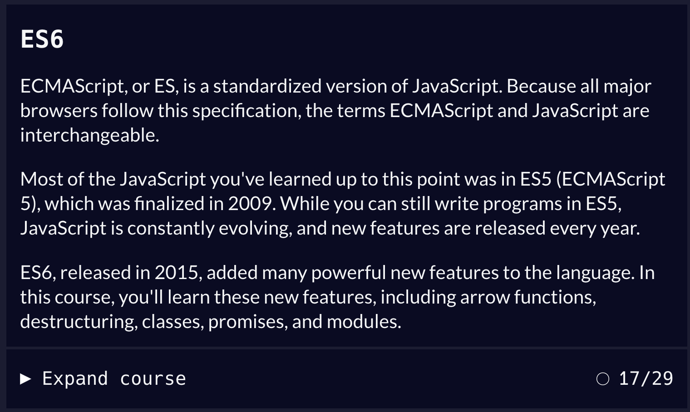   

>    

>    

>    

>  

1. So, the real coding journey has begun! It was my first time diving into the world of computer science and let me tell you, it was a wild ride! The course I took was a tough cookie for a newbie like me, but I was determined to crack the code (pun intended). I had to do some extra digging to get a grasp on the basics, and boy did I discover a lot of new and exciting things! Variables, arrays, functions... they finally started to make sense to me!

2. To my surprise, programming isn't just for the geniuses! Sure, it took some long hours of dedication, but with the right mindset (and a little bit of pep talk to myself), even someone with average IQ (like moi) can understand the concept. Personally, I was blown away by the implementation of recursion in JavaScript. As a fan of cosmic fractal bodies, I couldn't have been more thrilled!

3. I learned the basics of Javascript in this chapter and trust me, it's just the tip of the iceberg! But if I had to pick one thing that stood out, it would definitely be loops! I fell in love with them from the get-go and how they can be used to iterate anything and everything. The only downside is, I tend to gravitate towards using loops even when it's not entirely justified. Oh well, nobody's perfect, I'll work on it. Overall, I am motivated to keep learning and tackle more complex challenges every day! Here's to the next chapter!

## DOM

> 

>   
Coursera DOM Manipulation

> 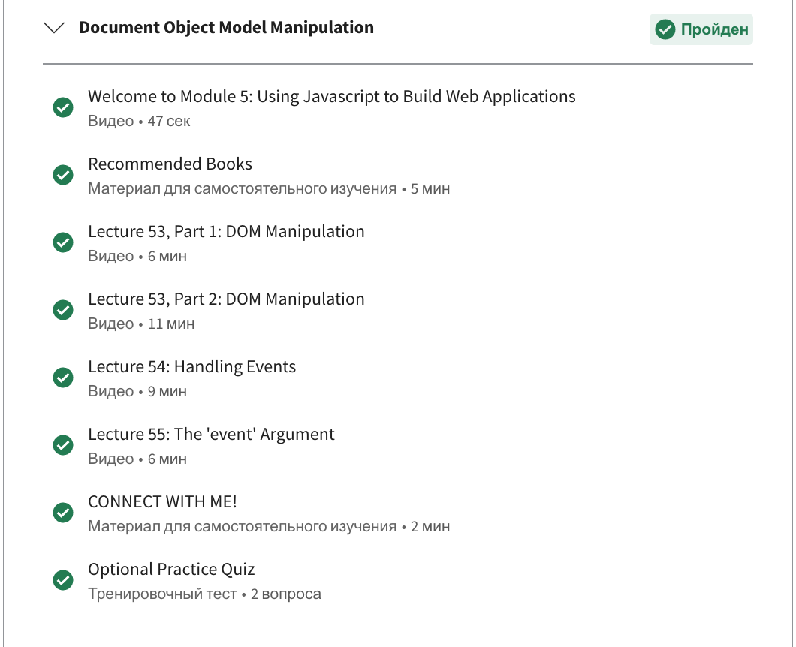 

> 

>   
FreeCodeCamp Intermediate Algorithm Scripting p.2

>  

[Demo](https://soft-malasada-c2cfcf.netlify.app/) | [Code Base](https://github.com/yazdrahobycha/DS-Wiki) | [Pull Request](https://github.com/kottans/frontend-2019-p2p/pull/222)  

1. Once again, I have encountered DOM manipulations for the first time (just like with everything else on this course in general)! It was initially daunting to apply my acquired knowledge to real tasks, but as I worked on them, the apprehension disappeared. The FreeCodeCamp assignments proved quite challenging for me, and I could spend an entire day on a single task (which is why the DOM task took me so long). However, these efforts were not in vain, as they helped my brain adopt a 'programmer's mindset' and taught me not to give up when faced with seemingly insurmountable difficulties.

2. I was amazed by the way in which an HTML page can be created and content can be uploaded into it! Now, when I have to create markup for a new task, it doesn't seem very cool to do everything manually. In fact, I was surprised by the flexibility of this method and how relatively easy it is to use!

3. I think that DOM methods will be used on a daily basis, and this is self-evident! As I mentioned in the previous paragraph, the method of creating and uploading HTML markup using JavaScript seemed much more sophisticated and flexible to me, so I am eager to find ways to apply this method as soon as possible!

## Tiny JS World

At first, I thought the task was quite easy, as I did not see any difficulties in implementing several objects. How wrong I was! The task turned out to be an infinite source of new concepts! Of course, at this stage, I was like a blind person, doing everything the old-fashioned way, so I have very little to tell at the moment!

## Object Oriented JS

> 

>   
[CodeWars](https://www.codewars.com/users/ArsenYavorskyi)

> 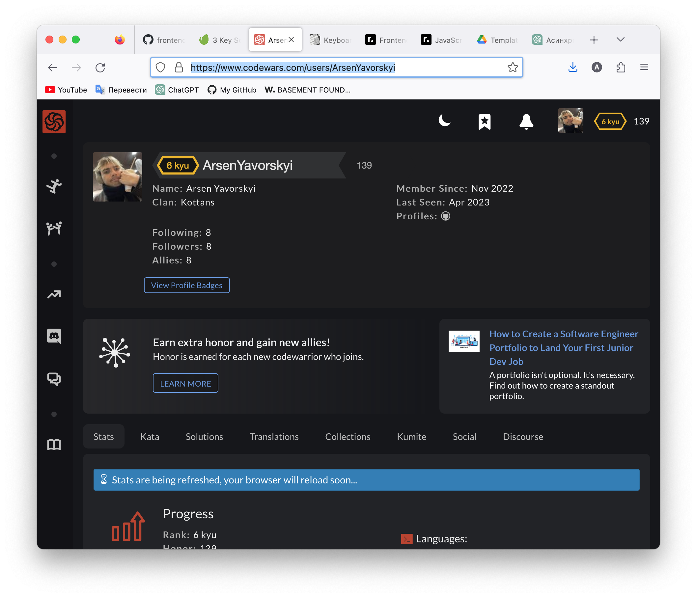 

Classic Frogger Game: [Demo](https://yazdrahobycha.github.io/classic-frogger-game/) | [Code Base](https://github.com/yazdrahobycha/classic-frogger-game/blob/master/js/app.js)

1. All the OOP concepts I learned were new to me, as was the very concept of OOP itself. I learned both ways of creating classes in JS, using classical prototypes and constructor functions, as well as with the help of new keywords such as class and super. I tried to delve into the concepts of DRY and SOLID and complete the programmer's task while adhering to the postulates defined in these concepts.

2. The concept of using and creating getters and setters greatly surprised me. I don't know how good it is, but it seemed to me such a beautiful realization of encapsulation and privacy that observing and using it brings me true, genuine pleasure!

3. Actually, I'm still not sure where I need to use my newly acquired knowledge of OOP. That is, while working on my own small projects, I see the use of OOP as excess, which can be completely coped with without it! Of course, I understand that this programming paradigm has many advantages, but at this stage, I get the impression that OOP is more useful for working with a large and long-term project, where the problem of maintaining and universalizing code is much more acute!

## OOP Exercise

[Demo](https://yazdrahobycha.github.io/a-tiny-JS-world/) | [Code Base](https://github.com/yazdrahobycha/a-tiny-JS-world/blob/master/index.js)

1. For the first time, I implemented prototypical inheritance in a new way introduced in ES6, and it was extremely interesting to delve into the real-world application of OOP principles. Specifically, what I learned during this task was how to better separate classes and pass parameters to them for greater flexibility of the classes themselves and for more readable code. I also implemented the OOP principle of polymorphism for the first time, which means I implemented a method that works correctly only with that class for each class.

2. I was surprised by the immutability of the inheritance concept in JS despite a completely different implementation on the outside. Under the hood, despite the introduction of new keywords, the same prototypical inheritance concept remained. I was also surprised to learn that the constructor of the constructor (Function() constructor) exists and is not the same as the constructor of the instance of the constructor. I'm still scratching my head over this!

3. Again, I can't imagine where I can apply this yet, but I'm confident that sooner or later I'll have to recall it and actively use it!
